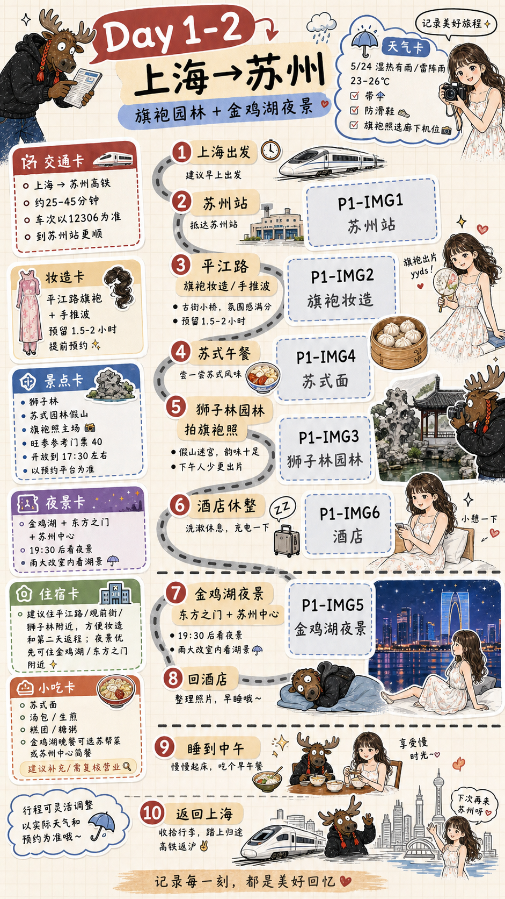

# Example: Shanghai To Suzhou One-Night Scrapbook

This is a generated demo image for the Shanghai to Suzhou one-night route.

## User Input

```text
我2026年5月24日~5月25日想从上海来苏州玩一天一夜。
第一天想体验一下苏式园林拍旗袍照，做手推波发型，晚上感受一下金鸡湖的夜景。
第二天睡到中午回上海，帮我做旅行手账图。
```

## Recommended Page Split

For this short low-density trip, generate 1 overview page:

```text
Page 1: Day1-2｜上海→苏州｜旗袍园林 + 金鸡湖夜景
```

Reason:

- Day 1 has the main travel flow: intercity train, qipao styling, garden photo session, night view.
- Day 2 is intentionally light: sleep until noon and return to Shanghai.
- One 9:16 page is clearer than two sparse pages.

## Route Logic

```text
上海 -> 苏州站 -> 平江路旗袍/手推波妆造 -> 午餐/苏式面 -> 狮子林园林拍照 -> 酒店休整 -> 金鸡湖/东方之门夜景 -> 回酒店 -> Day2睡到中午 -> 苏州站/园区站 -> 上海
```

## Replaceable Image Slots

| Slot ID | Visual | Purpose |
| --- | --- | --- |
| P1-IMG1 | 苏州站 / 到达 | arrival route node |
| P1-IMG2 | 平江路旗袍妆造 | styling and photo theme |
| P1-IMG3 | 狮子林园林 | core garden photo node |
| P1-IMG4 | 苏式面 / 生煎 / 糕团 | local food card |
| P1-IMG5 | 金鸡湖夜景 | evening route anchor |
| P1-IMG6 | 酒店 / 行李 | rest and luggage node |

## Demo Image


